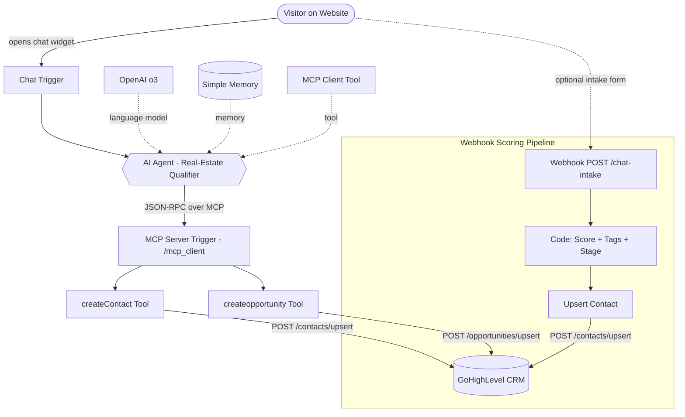

<div align="center">

# 🏡 Buy-To-Rent Intake Chatbot

### *An AI-powered lead qualification assistant for real-estate investors.* 🤖✨

A production-style **n8n automation** that turns a friendly chat conversation into a **fully scored, tagged, and CRM-synced lead** inside **GoHighLevel** — using an **AI Agent**, an **MCP Server**, and a parallel **webhook scoring pipeline**.

<br />


</div>

---

## 🎯 What it Does

The **Buy-To-Rent Intake Chatbot** sits inside any chat widget on a real-estate website and:

1. 👋 Greets the visitor and gets consent.
2. 📇 Captures **name, email & phone** (validated).
3. 🏘️ Walks them through **9 qualification questions** (city, budget, property type, rent, timeline, financing, experience, goal, notes).
4. 🧠 **Scores the lead** in real time and assigns a stage — *Hot · Warm · Nurture*.
5. 🏷️ Builds a structured set of **tags** for segmentation.
6. 💾 Pushes the contact + an opportunity into **GoHighLevel CRM** via an **MCP server** — after every single answer.
7. ✅ Confirms the recap with the user and politely closes.

Two complementary workflows ship in this repo:

| File | Role |
|---|---|
| 🤖 `Buy to rent Intake.json` | The **chat-facing AI Agent** workflow + a webhook-based scoring pipeline. |
| 🛰️ `MCP Server Buy to intake.json` | The **MCP Server** exposing `createContact` and `createopportunity` as agent tools. |

---

## 🧰 Tech Stack

| Layer            | Technology                                                            |
|------------------|-----------------------------------------------------------------------|
| ⚙️ Orchestration | **n8n** (cloud or self-hosted)                                        |
| 🧠 LLM           | **OpenAI `o3`** via `@n8n/n8n-nodes-langchain.lmChatOpenAi`           |
| 🤖 Agent         | **LangChain Agent** node with **Buffer Window Memory**                |
| 🛰️ Tooling       | **Model Context Protocol (MCP)** — server + client trigger nodes      |
| 🏢 CRM           | **GoHighLevel / LeadConnector** REST API                              |
| 🌐 Inbound       | **Webhook** (`POST /chat-intake`) for form-style intakes              |
| 🔢 Logic         | n8n **Code** nodes (JavaScript) for lead scoring & tagging            |

---

## 🗺️ Architecture

A picture is worth a thousand JSON nodes:



> 📎 A standalone `.mmd` source for the diagram is included for editing.

---

## 🔄 End-to-End Data Flow

### Path A — 💬 Conversational AI Agent

```text
Visitor ──► Chat Trigger ──► AI Agent (o3 + memory)
                                  │
                                  │  uses tool: mcp_client
                                  ▼
                          MCP Server Trigger
                          ├── createContact      ──► GoHighLevel: /contacts/upsert
                          └── createopportunity  ──► GoHighLevel: /opportunities/upsert
```

The agent calls the MCP tools **after every single answer** so the CRM record is always in sync — even mid-conversation.

### Path B — 📨 Webhook + Scoring Pipeline

```text
Form / Embed ──► POST /chat-intake ──► Code (score + tags + stage) ──► Upsert Contact ──► GoHighLevel
```

Used when leads come in from a static form or a third-party widget that just POSTs JSON.

---

## 🧮 Lead Scoring Logic

Implemented inside the **Code** node — pure JavaScript, fully transparent:

| Signal               | Condition                          | Points |
|----------------------|------------------------------------|:------:|
| 💰 Budget            | `budget_min ≥ 200,000`             | **30** |
| 🧑‍💼 Experience      | `5+ purchases`                     | **20** |
|                      | `2–5 purchases`                    | **10** |
| ⏰ Timeline          | `0–3 months`                       | **30** |
|                      | `3–6 months`                       | **20** |
|                      | `6–12 months`                      | **10** |
| 💳 Financing         | `Cash` or `Pre-approved mortgage`  | **20** |

### 🎚️ Stage Bands

| Score  | Stage              | Tag             |
|--------|--------------------|-----------------|
| **≥ 70** | 🔥 Qualified – Hot   | `score_hot`     |
| **40 – 69** | 🌤️ Qualified – Warm | `score_warm`    |
| **< 40**  | 🌱 Nurture          | `score_nurture` |

### 🏷️ Auto-Generated Tags

Always exactly 7 tags pushed to the CRM:

```text
source_chatwindow · intent_buy_to_rent · financing_* · tl_* · xp_* · pt_* · score_*
```

---

## 📇 Captured Lead Schema

The agent always emits this **exact** payload to the MCP `createContact` tool — keys, order and types are strict (unknown values are sent as `""`):

```json
{
  "firstName": "...",
  "lastName": "...",
  "email": "...",
  "phone": "+1...",
  "locationId": "6yJc24xDFknMMfEZH9iB",
  "customFields": [
    { "id": "XKMD24zBK6jK5gUHOztR", "value": "{budget_min}" },
    { "id": "SNhl6HVjjvIAWbzrXJ0V", "value": "{budget_max}" },
    { "id": "vbQLvm528IyPadydtbXL", "value": "{investment_goal}" },
    { "id": "i6Y6gwDQL6XktAsZS3MR", "value": "{timeline_to_buy}" },
    { "id": "5qnZXKPqf4c8ZYb0TE1c", "value": "{financing_status}" },
    { "id": "21FUKv1ITexmVcTwzoBk", "value": "{experience_level}" },
    { "id": "DlCYBtomAZO7PH8Jxp4q", "value": "{property_type}" },
    { "id": "r0BYsxoQqTCnyCq71N2z", "value": "{expected_rent}" },
    { "id": "nDZKFy4Ky7ITCiO59pFY", "value": "{lead_score}" }
  ],
  "tags": [
    "source_chatwindow", "intent_buy_to_rent",
    "{financing_tag}", "{timeline_tag}", "{experience_tag}",
    "{property_tag}", "{score_tag}"
  ]
}
```

After every `createContact` the agent also calls **`createopportunity`** to upsert a deal in the configured pipeline.

---

## 🧱 Workflow Breakdown

### 🤖 `Buy to rent Intake.json` — 11 nodes

| Node                                | Type                       | Purpose                                          |
|-------------------------------------|----------------------------|--------------------------------------------------|
| `When chat message received`        | Chat Trigger               | Entry point from the chat widget                 |
| `AI Agent`                          | LangChain Agent            | Drives the qualification conversation            |
| `OpenAI Chat Model`                 | LM (o3)                    | The brain of the agent                           |
| `Simple Memory`                     | Buffer Window Memory       | Keeps conversation context                       |
| `mcp_client`                        | MCP Client Tool            | Lets the agent call the MCP server's tools       |
| `Webhook`                           | Webhook (`POST /chat-intake`) | Form-based intake entry point                  |
| `Code`                              | JS                         | Lead score + stage + tags                        |
| `Upsert Contact`                    | HTTP Request               | Pushes scored lead into GoHighLevel              |
| `When clicking 'Execute workflow'`  | Manual Trigger             | Manual test entry point                          |
| `Code1`                             | JS                         | Builds a sample MCP JSON-RPC payload for testing |
| `HTTP Request`                      | HTTP                       | Hits the MCP endpoint for end-to-end test        |

### 🛰️ `MCP Server Buy to intake.json` — 3 nodes

| Node                  | Type                    | Purpose                                          |
|-----------------------|-------------------------|--------------------------------------------------|
| `MCP Server Trigger1` | MCP Trigger (`/mcp_client`) | Exposes this workflow as an MCP server       |
| `createContact`       | HTTP Tool               | Upserts a contact to `/contacts/upsert`          |
| `createopportunity`   | HTTP Tool               | Upserts an opportunity to `/opportunities/upsert`|

---

## 🚀 Getting Started

### ✅ Prerequisites

- An **n8n** instance (cloud or self-hosted, **v1.50+** recommended for MCP nodes)
- An **OpenAI API key** with access to `o3`
- A **GoHighLevel** sub-account with:
  - `locationId`
  - A configured **pipeline** & **stages** (used by `createopportunity`)
  - A **Private Integration Token** (`pit-…`) with `contacts.write` & `opportunities.write` scopes
- The **custom field IDs** in your GHL location matching those listed above (or remap them in the agent's system prompt)

### 📥 Import the Workflows

1. Open your n8n instance.
2. **Import** `MCP Server Buy to intake.json` first → activate it → copy the production MCP URL it exposes (looks like `https://<your-n8n>/mcp/mcp_client`).
3. **Import** `Buy to rent Intake.json`.
4. Open the **`mcp_client`** node and paste the MCP URL from step 2.
5. Add your credentials:
   - **OpenAI** → on the `OpenAI Chat Model` node.
   - **GoHighLevel Bearer token** → on the `createContact`, `createopportunity`, and `Upsert Contact` HTTP nodes.
6. Update the hard-coded IDs (`locationId`, `pipelineId`, `customFields[].id`) to match your GHL account.
7. Activate the workflow and grab the **Chat Trigger** URL — embed it in your site's chat widget.

### 🧪 Quick Test

- Open the chat trigger URL → say **"hi"** → walk through the qualification flow.
- Or hit the webhook directly:

```bash
curl -X POST https://<your-n8n>/webhook/chat-intake \
  -H "Content-Type: application/json" \
  -d '{
    "full_name": "Jane Doe",
    "email": "jane@example.com",
    "phone": "+15555550123",
    "budget_min": 250000,
    "budget_max": 500000,
    "property_type": "Single-family",
    "expected_rent": 2500,
    "timeline_to_buy": "0–3 months",
    "financing_status": "Cash",
    "experience_level": "5+ purchases",
    "investment_goal": "Cashflow"
  }'
```

You should see the contact appear in GoHighLevel with `score_hot` and the corresponding stage.

---

## 🔐 Security Notes

- 🚨 **Rotate any token that ever shipped in plain text.** The agent's system prompt contains a sample bearer token — replace it before going live and store secrets in **n8n Credentials**, never inline.
- 🛡️ Restrict the webhook with an auth header / shared secret if you expose it publicly.
- 🧱 Lock down the MCP Server Trigger with n8n's built-in MCP authentication.
- 📜 Review GHL custom-field & pipeline IDs before pushing to production.

---

## 🗺️ Roadmap

- [ ] 📞 Twilio SMS confirmation after lead capture
- [ ] 📨 Auto-send a tailored property list via email (Resend / Mailgun)
- [ ] 🌍 Multi-language qualification (EN / ES / AR)
- [ ] 📊 Looker Studio dashboard for lead score distribution
- [ ] 🧪 Unit tests for the scoring code via n8n's test runner
- [ ] 🔁 Slack notification for every `score_hot` lead

---

## 🤝 Contributing

PRs are welcome! 💛 Fork → branch (`feat/your-thing`) → commit → push → open a PR.

---

## 📜 License

Released under the **MIT License** — free to use, modify and adapt.

---

## 👤 Author

Designed and built by **me** with ❤️ using **n8n**, **OpenAI** & **MCP**.

**Author:** [@ahmadimran-15](https://github.com/ahmadimran-15)

<div align="center">

⭐ **If this helped you ship a smarter intake bot, drop a star — it really helps!** ⭐

</div>
